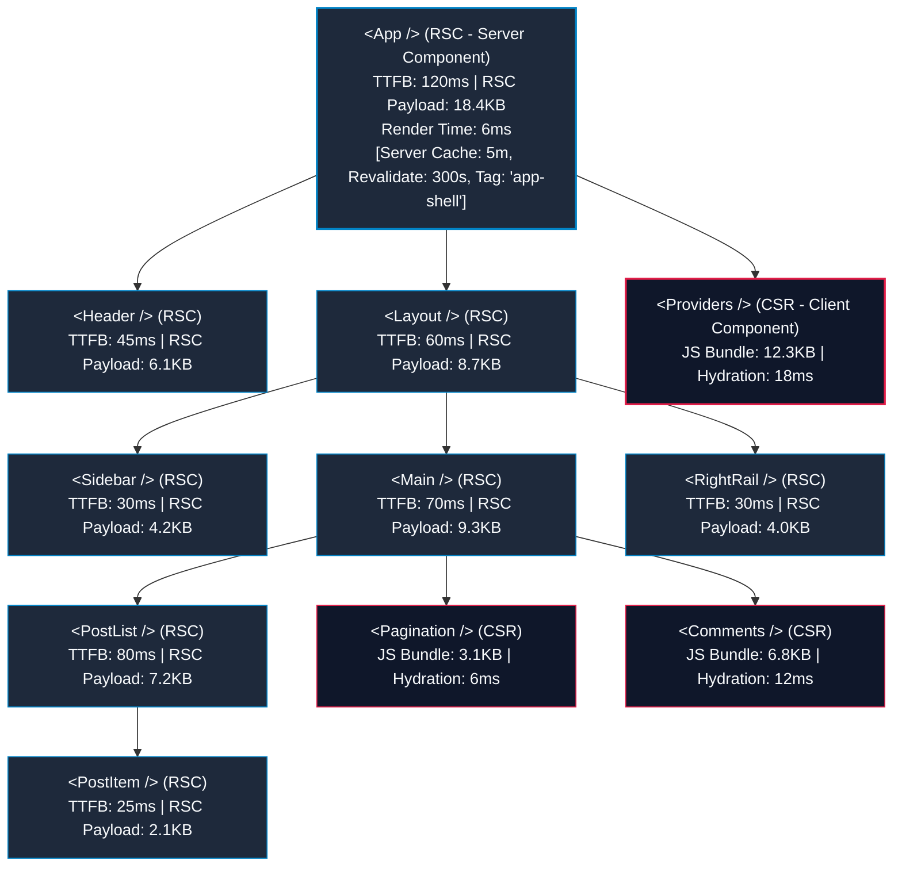

# Cẩm Nang Tối Ưu Hóa Hiệu Năng React (React Performance Playbook)

Tài liệu này được trích xuất và hệ thống hóa từ bản thiết kế kỹ thuật **React Performance Blueprint**, cung cấp 48 quy chuẩn tối ưu hóa hiệu năng, mô hình kiến trúc component và kim tự tháp ưu tiên hành động dành cho dự án React (Vite / Next.js).

---

## 🗺️ Phần 1: Kiến Trúc Cây Component React (React Component Tree Architecture)

Kiến trúc chuẩn của một ứng dụng React hiện đại cần phân tách rõ ràng vai trò giữa **Server Components (RSC)** và **Client Components (CSR)** để tối ưu dung lượng JavaScript tải về client và cải thiện tốc độ tương tác.



### 🗝️ Nguyên Tắc Thiết Kế Cốt Lõi:
1. **Server-First**: Giữ các component ở tầng cao (App, Layout, Sidebar, Main, PostList) làm **Server Components** để xử lý dữ liệu gần database nhất, loại bỏ hoàn toàn mã JavaScript của chúng khỏi client.
2. **Cô lập Client State**: Chỉ sử dụng **Client Components** (`"use client"`) cho các thành phần cần tương tác động (như `Pagination`, `Comments`, `Providers`) hoặc dùng React Hooks (`useState`, `useEffect`).
3. **Biên giới Bất đồng bộ (Async Boundaries)**: Đặt các component bất đồng bộ độc lập (ví dụ `<Sidebar />`, `<Comments />`) vào trong `<Suspense>` để chúng tải song song và không chặn tiến trình render của nhau (`async-parallel`).
4. **Tách nhỏ Bundle động (bundle-dynamic)**: Áp dụng Lazy Loading/Code Splitting cho các Client Component nặng để giảm thiểu kích thước bundle ban đầu.

---

## 🔺 Phần 2: Kim Tự Tháp Ưu Tiên Tối Ưu Hóa (React Performance Pyramid)

Để đạt hiệu quả tối ưu cao nhất với chi phí phát triển thấp nhất, hãy tập trung giải quyết theo thứ tự ưu tiên từ trên xuống dưới:

```
                      /\
                     /  \
                    / 01 \  <-- CRITICAL: Tối ưu hóa Bundle & Load (Tránh Waterfalls, giảm tải JS)
                   /------\
                  /   02   \  <-- HIGH: Server-Side Rendering (Tối ưu TTFB, Streaming, Edge caching)
                 /----------\
                /    03      \  <-- HIGH: Data Fetching & Caching (Tải song song, SWR, Request Deduplication)
               /--------------\
              /      04        \  <-- HIGH: Code Splitting & Lazy Loading (lazy(), Route splitting)
             /------------------\
            /        05          \  <-- MEDIUM: Kiểm soát Re-renders & State (React.memo, useMemo, useCallback)
           /----------------------\
          /          06            \  <-- MEDIUM: Tối ưu Render Pipeline (Windowing/Virtualization, Suspense)
         /--------------------------\
        /            07              \  <-- MEDIUM: Tối ưu hóa Tài nguyên & Assets (Ảnh, Fonts, Compression)
       /------------------------------\
      /              08                \  <-- LOW: Công cụ & Trải nghiệm Lập trình (Bundle analyzer, budgets)
     /__________________________________\
```

---

## 📋 Phần 3: 48 Quy Tắc Tối Ưu Hiệu Năng React (48 React Performance Rules)

Dưới đây là chi tiết 48 quy tắc kỹ thuật được chia thành 8 danh mục hành động cụ thể, kèm theo ví dụ áp dụng thực tế:

### 1. Asynchronous (Bất đồng bộ & Hạn chế Thác nước)
*Mục tiêu: Giảm thiểu thời gian nhàn rỗi (idle time) và loại bỏ hiện tượng tải dữ liệu tuần tự nghẽn cổ chai (waterfalls).*

*   **`async-parallelize-requests` (01)**: Thực hiện đồng thời các API requests không phụ thuộc nhau thay vì đợi tuần tự.
*   **`async-use-promise-all` (02)**: Nhóm các Promise độc lập bằng `Promise.all` hoặc `Promise.allSettled`.
    ```typescript
    // ❌ Sai (Waterfall)
    const users = await fetchUsers();
    const posts = await fetchPosts();

    //  Đúng (Tải song song)
    const [users, posts] = await Promise.all([fetchUsers(), fetchPosts()]);
    ```
*   **`async-avoid-await-in-loop` (03)**: Tuyệt đối không đặt `await` bên trong vòng lặp `for` hoặc `forEach`. Sử dụng `map` tạo danh sách Promise rồi giải quyết đồng loạt bằng `Promise.all`.
*   **`async-prefetch-early` (04)**: Kích hoạt tải trước dữ liệu khi người dùng rê chuột (hover) qua link hoặc menu trước khi họ thực sự click.
*   **`async-use-suspense` (05)**: Bao bọc các tiến trình bất đồng bộ bằng `<Suspense>` để giao diện không bị đóng băng khi đợi dữ liệu.
*   **`async-handle-timeouts` (06)**: Đặt giới hạn thời gian (timeout) cho mọi API request để tránh giao diện tải vô tận khi mạng gặp sự cố.

---

### 2. Bundle & Code (Tối ưu dung lượng mã JavaScript tải về)
*Mục tiêu: Đưa lượng JavaScript tải về trình duyệt về mức tối giản để tăng tốc độ phân tích cú pháp (parse) và thực thi (evaluate).*

*   **`bundle-code-split-routes` (07)**: Phân tách bundle theo từng tuyến đường (Route-based splitting). Mỗi route chỉ tải file JS tương ứng.
*   **`bundle-lazy-load-components` (08)**: Tải chậm các component nặng (biểu đồ, trình soạn thảo text) bằng `React.lazy` hoặc Dynamic Import.
    ```tsx
    import { lazy, Suspense } from 'react';
    const HugeChart = lazy(() => import('./components/HugeChart'));

    function Dashboard() {
      return (
        <Suspense fallback={<div>Loading chart...</div>}>
          <HugeChart />
        </Suspense>
      );
    }
    ```
*   **`bundle-tree-shake-imports` (09)**: Tránh import toàn bộ thư viện lớn. Sử dụng cấu trúc import con cụ thể.
    ```typescript
    // ❌ Sai
    import { debounce } from 'lodash';
    //  Đúng
    import debounce from 'lodash/debounce'; // hoặc import { debounce } từ 'lodash-es'
    ```
*   **`bundle-remove-dead-code` (10)**: Loại bỏ triệt để các dead-code, code thử nghiệm và `console.log` bằng minify tool (Terser/Esbuild) trong cấu hình production.
*   **`bundle-optimize-deps` (11)**: Sử dụng các thư viện nhẹ thay thế cho thư viện cũ cồng kềnh (Ví dụ: dùng `date-fns` hay `dayjs` thay thế cho `moment`).
*   **`bundle-analyze-bundle` (12)**: Sử dụng các công cụ phân tích bundle (`rollup-plugin-visualizer` cho Vite) trong pipeline CI/CD để kiểm soát kích thước bundle.

---

### 3. Server & Runtime (Tận dụng sức mạnh Server & Modern Runtimes)
*Mục tiêu: Rút ngắn thời gian Time-to-First-Byte (TTFB) và giảm tải tài nguyên xử lý trên client.*

*   **`server-use-ssr-or-ssg` (13)**: Sử dụng Server-Side Rendering (SSR) hoặc Static Site Generation (SSG) cho các trang public cần SEO và hiển thị nhanh.
*   **`server-stream-with-suspense` (14)**: Áp dụng cơ chế Streaming HTML để trả trước phần khung giao diện tĩnh, các phần dữ liệu động sẽ được stream về sau.
*   **`server-use-server-components` (15)**: Tận dụng React Server Components (RSC) mặc định cho các xử lý logic nặng, giao tiếp trực tiếp với database.
*   **`server-minimize-client-js` (16)**: Giới hạn tối đa việc khai báo `"use client"`. Đưa các nút tương tác nhỏ xuống sâu nhất có thể để giữ các component cha ở dạng Server Component.
*   **`server-compress-responses` (17)**: Kích hoạt nén Brotli/Gzip trên server/CDN cho toàn bộ mã nguồn tĩnh và phản hồi API.
*   **`server-use-edge-runtime` (18)**: Chạy ứng dụng trên môi trường Edge Runtime (gần vị trí địa lý của người dùng nhất) để giảm độ trễ mạng xuống mức tối thiểu.

---

### 4. Re-render Control (Kiểm soát tiến trình cập nhật giao diện)
*Mục tiêu: Ngăn chặn các component render lại một cách vô ích khi dữ liệu của chúng không hề thay đổi.*

*   **`rerender-avoid-new-refs` (19)**: Tránh khai báo trực tiếp Object/Array rỗng làm default prop hoặc giá trị khởi tạo trong hàm render vì nó sẽ tạo tham chiếu mới mỗi lần chạy.
    ```tsx
    // ❌ Sai
    const items = data || [];
    //  Đúng
    const EMPTY_ARRAY: any[] = [];
    const items = data || EMPTY_ARRAY;
    ```
*   **`rerender-stable-props` (20)**: Giữ các giá trị truyền xuống component con ổn định về mặt tham chiếu để `React.memo` có thể hoạt động chính xác.
*   **`rerender-split-components` (21)**: Tách component lớn thành các component con nhỏ hơn. Thành phần nào chứa state hay biến đổi liên tục thì cô lập riêng để tránh re-render cả trang lớn.
*   **`rerender-lift-state-down` (22)**: Ngược lại với lift-state-up, hãy đưa state xuống component sâu nhất có thể nếu nó chỉ được dùng ở một nhánh nhỏ.
*   **`rerender-avoid-inline-fn` (23)**: Không định nghĩa hàm ẩn danh (inline function) trực tiếp trong các prop của JSX.
    ```tsx
    // ❌ Sai
    <button onClick={() => handleClick(id)}>Click</button>

    //  Đúng
    const onSelect = useCallback(() => handleClick(id), [id]);
    <button onClick={onSelect}>Click</button>
    ```
*   **`rerender-batch-state-updates` (24)**: Gộp nhiều cập nhật state liên tiếp lại với nhau bằng cơ chế tự động batching của React 18+, tránh thực thi cập nhật riêng lẻ trong các hàm bất đồng bộ cũ.

---

### 5. Memoization (Ghi nhớ & Tối ưu hóa tham chiếu)
*Mục tiêu: Lưu trữ kết quả tính toán đắt đỏ và tránh tạo lại tham chiếu hàm/dữ liệu.*

*   **`memo-use-react-memo` (25)**: Bao bọc component con bằng `React.memo` khi component đó nhận prop dạng primitive hoặc stable tham chiếu và re-render thường xuyên vô ích từ component cha.
*   **`memo-use-usememo` (26)**: Lưu trữ kết quả của các hàm tính toán phức tạp hoặc chuyển đổi cấu trúc mảng lớn bằng `useMemo`.
    ```typescript
    const sortedList = useMemo(() => {
      return [...list].sort((a, b) => b.score - a.score);
    }, [list]);
    ```
*   **`memo-use-usecallback` (27)**: Lưu trữ định nghĩa hàm callback truyền xuống component con bằng `useCallback` để giữ tính ổn định tham chiếu.
*   **`memo-memoize-selectors` (28)**: Khi sử dụng state management (Zustand, Redux), sử dụng selector có memoize để tránh component re-render khi các phần state khác thay đổi.
*   **`memo-stable-context-value` (29)**: Luôn bao bọc giá trị của `Context.Provider` bằng `useMemo` để ngăn chặn việc toàn bộ các component tiêu thụ context re-render khi component cha thay đổi state.
    ```tsx
    const value = useMemo(() => ({ user, login, logout }), [user]);
    return <AuthContext.Provider value={value}>{children}</AuthContext.Provider>;
    ```
*   **`memo-avoid-deep-objects` (30)**: Tránh lưu trữ cấu trúc nested object quá sâu làm dependency cho React Hooks. Ưu tiên flatten dữ liệu trước khi xử lý.

---

### 6. Data & Fetching (Luồng dữ liệu tối ưu)
*Mục tiêu: Giao tiếp API thông minh, giảm thiểu số lượng dữ liệu dư thừa đi qua đường truyền internet.*

*   **`data-dedupe-requests` (31)**: Triệt tiêu các API requests bị kích hoạt trùng lặp trong cùng một khoảng thời gian cực ngắn.
*   **`data-cache-requests` (32)**: Sử dụng các thư viện quản lý dữ liệu thông minh có cơ chế caching tự động (TanStack Query / SWR).
*   **`data-use-stale-while-revalidate` (33)**: Hiển thị ngay lập tức dữ liệu cũ có trong cache (stale), đồng thời kích hoạt request ngầm để cập nhật dữ liệu mới nhất (revalidate).
*   **`data-paginate-large-lists` (34)**: Luôn phân trang (pagination), tải thêm (infinite scroll) hoặc lazy load dữ liệu danh sách thay vì fetch một lần hàng ngàn bản ghi.
*   **`data-avoid-over-fetching` (35)**: Thiết kế API chỉ trả về các trường dữ liệu cần thiết cho giao diện. Tránh gửi kèm các dữ liệu thừa không bao giờ hiển thị.
*   **`data-normalize-data` (36)**: Chuẩn hóa dữ liệu lưu trữ phía client dưới dạng key-value map để thực hiện cập nhật tức thời (optimistic updates) hiệu quả.

---

### 7. Caching Strategies (Đa tầng Caching)
*Mục tiêu: Đưa bộ nhớ đệm vào mọi lớp kiến trúc để giảm tải truy vấn máy chủ.*

*   **`cache-use-browser-cache` (37)**: Tận dụng LocalStorage, SessionStorage hoặc IndexedDB cho các cấu hình ứng dụng, thông tin phiên làm việc và dữ liệu ít thay đổi.
*   **`cache-use-http-cache-headers` (38)**: Cấu hình chuẩn xác HTTP Headers trên server (`Cache-Control: public, max-age=31536000`, `ETag`) cho các file tĩnh để trình duyệt không phải tải lại.
*   **`cache-use-service-worker` (39)**: Thiết lập Service Worker (PWA) để lưu trữ cache các tài nguyên tĩnh ngoại tuyến (Offline-First).
*   **`cache-cache-components` (40)**: Lưu trữ các component tĩnh hoặc component sinh nội dung tốn nhiều tài nguyên render vào CDN ở chế độ Server Edge Caching.
*   **`cache-cache-images` (41)**: Định cấu hình cache ảnh trên CDN với thời gian lưu trữ dài hạn và tối ưu kích thước ảnh động dựa trên màn hình thiết bị.
*   **`cache-cache-queries` (42)**: Cache kết quả các truy vấn cơ sở dữ liệu hoặc API tốn kém tại Server App Layer (ví dụ dùng Redis) với cơ chế giải phóng cache (invalidation) hợp lý.

---

### 8. Render Performance (Hiển thị giao diện mượt mà)
*Mục tiêu: Giữ khung hình ổn định ở mức 60 FPS (hoặc cao hơn), giảm thiểu giật lag giao diện (Jank).*

*   **`render-window-long-lists` (43)**: Áp dụng cơ chế ảo hóa danh sách (List Virtualization / Windowing) bằng `react-window` hoặc `react-virtuoso` cho các danh sách lớn hơn 100 dòng. Chỉ render các dòng đang nằm trong viewport.
*   **`render-avoid-layout-thrashing` (44)**: Tránh xen kẽ liên tục việc đọc và ghi thuộc tính DOM trực tiếp (ví dụ đọc `element.offsetHeight` rồi lập tức thay đổi `element.style.height`), gây ra hiện tượng trình duyệt phải tính toán lại bố cục (Reflow) liên tục.
*   **`render-use-css-instead-js` (45)**: Ưu tiên dùng CSS để xử lý animation/transition thay vì dùng JS để giải phóng CPU thread.
*   **`render-will-change-sparingly` (46)**: Sử dụng thuộc tính CSS `will-change` một cách cẩn trọng và chỉ đặt cho các phần tử thực sự chuẩn bị chuyển động để kích hoạt tăng tốc phần cứng (GPU Acceleration).
*   **`render-optimize-animations` (47)**: Đảm bảo các chuyển động JS được quản lý bằng `requestAnimationFrame` và chỉ tác động vào các thuộc tính tối ưu không gây reflow/repaint (`transform`, `opacity`).
*   **`render-measure-in-production` (48)**: Thu thập chỉ số trải nghiệm người dùng thực (Real User Monitoring - RUM) thông qua công cụ Web Vitals đo đạc chỉ số thời gian thực (LCP, CLS, INP, TTFB) để đưa ra định hướng tối ưu hóa tiếp theo.

---

## 📊 Phần 4: So Sánh Hiệu Năng Trước & Sau Tối Ưu Hóa (Benchmark)

Bảng so sánh trực quan dưới đây thể hiện sự vượt trội khi áp dụng triệt để bộ quy chuẩn tối ưu hóa này:

| Chỉ số Hiệu Năng | Trước Tối Ưu Hóa (Chưa kiểm soát) | Sau Tối Ưu Hóa (Chuẩn hóa) | Đánh giá & Cải tiến |
| :--- | :--- | :--- | :--- |
| **Điểm Hiệu Năng (Lighthouse)**| **32 / 100** (Grade F) | **92 / 100** (Grade A) | 📈 Cải thiện **+60 điểm** |
| **Data Fetching** | Tuần tự dạng thác nước (Waterfall)<br/>Kích hoạt API nối tiếp nhau mất >4000ms | Song song đồng thời (Parallel)<br/>Hoàn tất toàn bộ API chỉ trong 1000ms | ⚡ Nhanh hơn gấp **4 lần** |
| **Dung lượng JS Bundle** | **2.45 MB** monolithic bundle<br/>(Parse: 480ms \| Eval: 320ms) | **285 KB** chia nhỏ (vendor, ui, route)<br/>(Parse: 55ms \| Eval: 40ms) | 📦 Giảm dung lượng tới **88%** |
| **Độ sâu Dependency Graph** | Độ sâu: **6** \| Số nút: **42** | Độ sâu: **2** \| Số nút: **11** | 🌳 Cấu trúc nông, giải quyết nhanh |
| **Luồng Render** | Re-render liên tiếp từ cha xuống con vô ích | Batching cập nhật và Memoization chuẩn | ⚡ Tránh lãng phí 90% CPU |
| **Time to First Byte (TTFB)** | 1.2 giây | 210ms | 🚀 Giảm **82%** thời gian chờ phản hồi |
| **Largest Contentful Paint (LCP)** | 4.6 giây | 1.3 giây | 🎨 Trực quan hóa cực nhanh |
| **Total Blocking Time (TBT)** | 1250ms | 120ms | 🖱️ Ứng dụng phản hồi click ngay lập tức |

---

## 🛠️ Phần 5: Hướng Dẫn Tích Hợp Vào Dự Án Thực Tế (AMS / Vite React)

Để đưa các quy tắc này vào dự án của bạn một cách tự động và nghiêm ngặt, hãy cấu hình hệ thống công cụ hỗ trợ như dưới đây:

### 1. Cấu hình ESLint để tự động bắt lỗi Re-render và Memoization
Chỉnh sửa file `eslint.config.js` để tích hợp thêm các plugin bảo vệ hiệu năng:

```javascript
// eslint.config.js
import js from '@eslint/js'
import globals from 'globals'
import reactHooks from 'eslint-plugin-react-hooks'
import reactRefresh from 'eslint-plugin-react-refresh'
import tseslint from 'typescript-eslint'
import { defineConfig, globalIgnores } from 'eslint/config'

export default defineConfig([
  globalIgnores(['dist']),
  {
    files: ['**/*.{ts,tsx}'],
    extends: [
      js.configs.recommended,
      ...tseslint.configs.recommended,
      reactHooks.configs.flat.recommended,
      reactRefresh.configs.vite,
    ],
    languageOptions: {
      globals: globals.browser,
    },
    rules: {
      // Ép buộc kiểm soát chặt chẽ dependency array của useEffect/useMemo/useCallback
      'react-hooks/exhaustive-deps': 'warn',
      
      // Bắt buộc xử lý async đúng chuẩn, tránh waterfalls và lặp
      'no-await-in-loop': 'error',
      
      // Cấm khai báo inline object/array trực tiếp trong JSX props để tránh mất ref
      'react/jsx-no-constructed-context-values': 'error',
    }
  },
])
```

### 2. Cấu hình Vite Code Splitting động trong `vite.config.ts`
Để chia nhỏ bundle khổng lồ (`main.bundle.js` trước đây) thành các mảnh nhỏ tải bất đồng bộ:

```typescript
// vite.config.ts
import { defineConfig } from 'vite'
import react from '@vitejs/plugin-react'
import tailwindcss from '@tailwindcss/vite'

export default defineConfig({
  plugins: [react(), tailwindcss()],
  build: {
    rollupOptions: {
      output: {
        // Tách nhỏ các thư viện lớn trong node_modules ra bundle vendor riêng biệt
        manualChunks(id) {
          if (id.includes('node_modules')) {
            if (id.includes('react') || id.includes('react-dom') || id.includes('react-router')) {
              return 'vendor-core'; // Core framework
            }
            if (id.includes('@radix-ui') || id.includes('lucide-react')) {
              return 'vendor-ui'; // UI components & icons
            }
            return 'vendor-libs'; // Các lib khác
          }
        }
      }
    },
    // Giới hạn cảnh báo kích thước chunk
    chunkSizeWarningLimit: 500, 
  }
})
```

### 3. Code Mẫu: Chuyển đổi từ Tải tuần tự (Waterfall) sang Song song (Parallel)
Đây là cách xử lý chuẩn khi component cần tải dữ liệu từ nhiều nguồn khác nhau cùng lúc:

```tsx
// ❌ Trước tối ưu hóa (Waterfall cực kỳ chậm)
useEffect(() => {
  const loadData = async () => {
    setLoading(true);
    const userInfo = await api.getUserProfile(); // Đợi...
    const posts = await api.getUserPosts(userInfo.id); // Đợi tiếp...
    const config = await api.getSystemConfig(); // Mất thêm thời gian...
    setData({ userInfo, posts, config });
    setLoading(false);
  };
  loadData();
}, []);

//  Sau tối ưu hóa (Parallel tải song song + Cô lập config không phụ thuộc)
useEffect(() => {
  const loadData = async () => {
    setLoading(true);
    try {
      // 1. Khởi chạy song song các requests không liên quan đến nhau
      const [configPromise, userInfoPromise] = [
        api.getSystemConfig(),
        api.getUserProfile()
      ];
      
      const userInfo = await userInfoPromise;
      const config = await configPromise;
      
      // 2. Chỉ thực hiện request tiếp theo khi có dữ liệu phụ thuộc (userInfo.id)
      const posts = await api.getUserPosts(userInfo.id);
      
      setData({ userInfo, posts, config });
    } catch (error) {
      console.error("Tải dữ liệu thất bại", error);
    } finally {
      setLoading(false);
    }
  };
  loadData();
}, []);
```

---

## 📈 Quy trình Duy trì Hiệu năng (Performance Maintenance Cycle)
1. **Đo lường trước tiên**: Luôn mở tab **React Profiler** hoặc Lighthouse để ghi lại dữ liệu nền trước khi bắt đầu tối ưu hóa.
2. **Nguyên lý 80/20**: Tập trung tối ưu hóa các thành phần nằm trong nhóm **Critical** và **High** của kim tự tháp (Data fetching, Bundle size, Code splitting) vì chúng đóng góp 80% sự cải thiện trải nghiệm người dùng thực.
3. **Thực thi CI/CD Gate**: Kiểm soát nghiêm ngặt dung lượng bundle bằng các bước check tự động trước khi merge PR.
